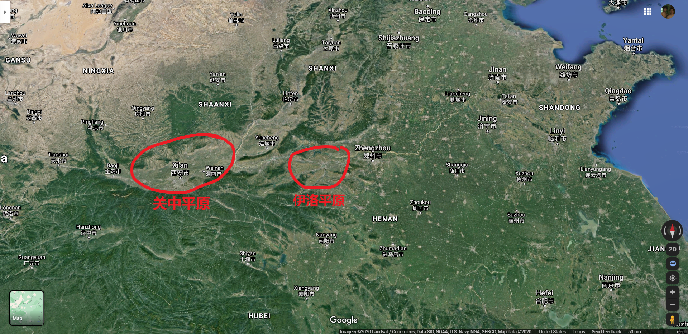
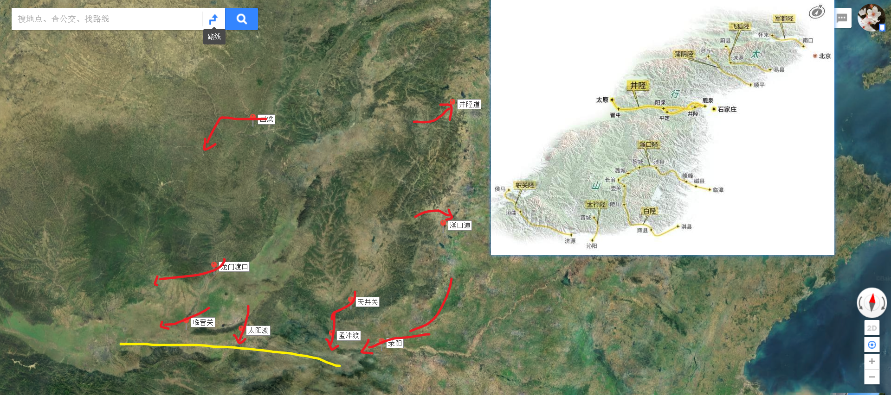
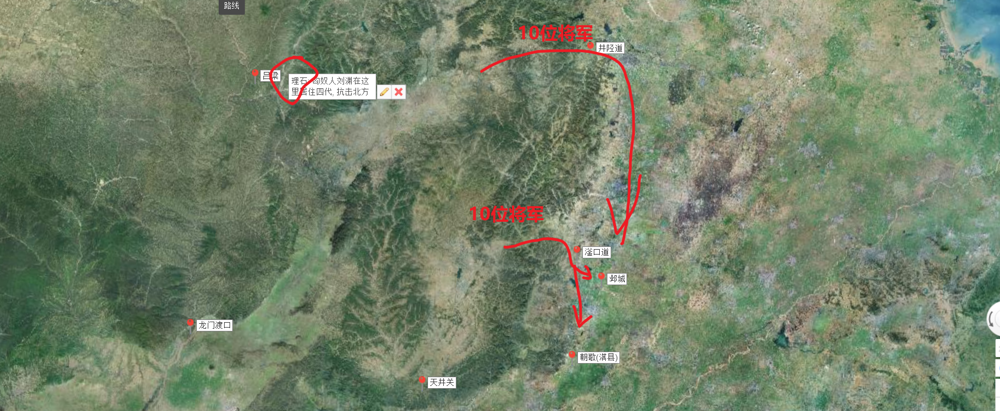
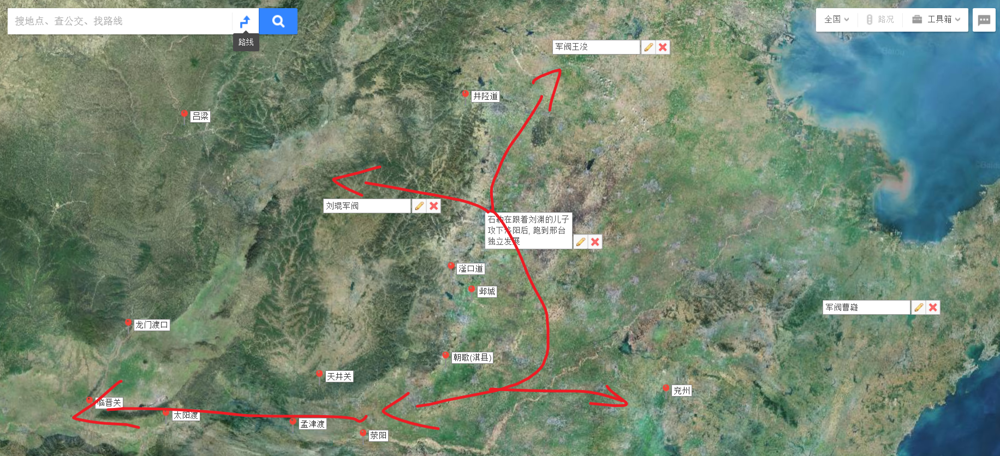

### 想巩固政权，却导致皇族内乱

**晋朝之前的三国几十年的分裂, 各国的政治都变了:**

- 魏国继承了汉代的集权制; 
- 东吴依靠江东的世家大族统治, 权力更加分散;
- 蜀汉地理的封闭, 与其他地区相比有很强的离心倾向.

晋国统一之后, 面临的问题就是把集权的官僚制度统一全国. 晋武帝司马炎搁置这个问题, 临死前借鉴汉代同姓王侯进行统治, 设置了四个拱卫中原的大诸侯王, 每个都有私人军队.最初各个王在首都里, 司马炎晚年怕被外戚一锅端, 放回封地去了.

司马炎死后立刻引起了一系列的冲突。外戚、本家各王如同走马灯一样在朝廷出入, 西晋崩了. 八王之乱, 7个没有善终.

- 四川: 少数民族氐人进入四川, 在李特兄弟带领, 创建大成政权, 分离了.
- 孙吴统治的区域, 也爆发两次武装冲突, 但被镇压了. 琅琊王司马睿去镇守江东, 成为东晋开国基础.

### 两赵之役：从山西统一北中国

之前人们认为北方战略基地:

- 关中平原: 三国时候关中战乱.很难恢复
- 伊洛平原: 险要地理优势, 但是山西克星.

**并州地理:** 对左右下都有地理优势: 

**两晋南北朝时期，从山西进入陕西，进攻长安的道路主要有四条**

**刘渊占陕西河北:**

刘渊死后, 他的儿子刘聪继续父亲的战略, 攻克了洛阳, 俘虏了晋怀帝. 随即转向进攻长安, 俘虏了晋愍帝, 西晋灭亡.

刘聪病死, 臣子作乱, 儿子被杀, **族子刘曜登上了王位，改国号为赵，历史上称为前赵**

**石勒**曾经是刘渊手下的将领，在攻克了洛阳之后，走上了独立发展的道路，直到完全占领了山西、河北之后，才与刘曜脱离了关系。石勒统一北方、建立政权的过程，从某种程度来说，就是刘氏开基的翻版，也是从河北、山西开始，以进攻洛阳和长安两京为最终目标。但石勒的做法与刘氏又有一定的不同，这些不同决定了他能够取得更大的成功。

石勒的国家也是短暂的。他可以建立一个帝国，表面上也消灭了敌对势力，但在将这个支离破碎的帝国从表面上捏到一块之后，却无法让它生长出筋骨变成真正的整体。只有帝国内部取得足够的经济发展时，才会产生足够的向心力和凝聚力。作为蛮人的石勒懂得厮杀，却并没有完成后一步。

后赵攻克长安二十年后，再次陷入了内乱，一个叫作冉闵的将领夺取了皇权，建立了短命的冉魏政权。一年后，冉魏政权被北方崛起的慕容氏燕国所灭。北方再次陷入了分崩离析的混乱之中。

