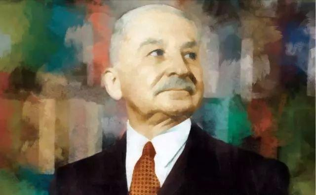

> 他对自由理念的阐述是那么地清晰，即使是未受过教育的人士也可以理解，让那些鼓吹极权的人们再也不能迷惑他们了.  -- 沃尔特 E.威廉姆斯
>
> 巴斯夏的话听来如此新鲜, 仿佛就是今天写的.  -- 谢尔登·瑞奇曼
>
> 由于我总是打心眼里热爱自由, 所以, 我简直没法理性地给自由下个定义.  -- 巴斯夏

巴斯夏是一个有古典自由主义主张的人, 他生活在1800-1850年的法国, 在生命的最后几年写了一些书和文章, <财产, 法律与政府>是他的一本不全的中短篇合集. 巴斯夏的一生不算太长, 而且他主要在最后几年写作, 所以这本书不算厚, 电子书10w字左右. 巴斯夏写作的用语非常严谨, 语句偏长, 翻译成中文更是如此, 所以读起来很吃力, 但这本书的内容非常吸引我, 我通过读这本书想通了很多道理, 而且巴斯夏非常善于讲故事作类比, 理解了之后感觉非常有趣. 我最近在看米塞斯的<自由与繁荣的国度>, 不同文风的差异感觉很明显, 更觉得巴斯夏的风趣幽默非常难得, 尤其是巴斯夏生活在自由主义盛行的初期, 这种讲两句道理来几个讽刺幽默故事的文风更是有意思. 

读这本书, 我无数次感叹关于自由的一切, 巴斯夏讲的是如此的清楚明白. 不敢说复述这本书的内容, 我想把通过这本书想明白或者想的更清晰问题尽量清楚的记下来. 

### 看得见的和看不见的 - 政府分配是浪费

这是这本书的第一章, 讲的是政府为人民做的好事和做这些好事的成本. 巴斯夏把政府分配比作一只看得见的手, 这只手从一些人那里取走财物, 施舍给另一些人, 但这是一只看得见的手, 它的另一半是一只看不见的手, 被抢走财物的人要降低自己的生活标准. 而且巴斯夏指出这两只手做的事情之间是非常低效和浪费的. 而且是非常非常不道德的. 

之前我明白这个道理, 但是巴斯夏这一张里面讲得太精彩了, 各种小故事非常吸引人. 我结合自己的理解也讲几个.

> 如果你把所有为贸易限制辩护的论证追根溯源，你所看到的，其实就只是老百姓的这句话：如果没有人打破窗户，玻璃工干什么去呀。

著名的破窗理论, 玻璃打破了就需要换, 然后这笔交易就让社会就多了一张玻璃的财富. 这让人听起来荒谬致极, 但确实很多人是这样被说服的: 花10块钱买一张玻璃, 工厂生产出来, 社会就多了一张玻璃了. 这显然只是那只看得见的手, 如果玻璃没有破, 这10块钱同样可以让社会增加一个水杯的财富, 但因为玻璃被打碎了, 水杯没有了, 这才是那只看不见的手, 打破玻璃后社会最终损失了一张玻璃的价值. 尽管这个道理废话到弱智, 但如果不是玻璃而换成其他的东西, 再加入一个中介(GOV), 那么就会发生我们今天看到的很多事情, 比如前些年四川大地震, 很多人在讲震后的经济增长, 仿佛当地经济后来更繁荣是多亏了地震. 

公办博物馆/图书的问题, 很多人再谈一个城市的时候都在说一定要去xxx博物馆看看, 这样可以看到一座城市的历史和人文, 每座城市也把这些馆当成自己的名片, 公立的, 全免费, 夏天吹空调冬天有暖气. 这当然是看得见的手了, 看不见的是当地政府债台高筑, 靠房地产/税务勒索/赖账/...搞一些钱. 对于那些喜欢在博物馆拍照打卡的人当然不在乎啦, 在艺术上花的钱怎么能叫浪费呢, 这叫投资. (公立大学也是如此.

关税的合理性. 为了让东北农民的大豆能卖出去, 我们要给美国大豆加一点税, 让美国的大豆价格和东北的大豆价格一样了, 这样农民们也能维持生计, 国家还能搞比税收, 一举两得. 看不见的手里面握着这样做的成本, 北京的豆汁本来可以用美国的大豆买到一块五, 结果洪水来了, 东北大豆更便宜了, 豆汁两块钱一碗. 某老北京高大爷不喝豆汁就头晕, 某闰年喝了366碗, 多花188元, 与此同时隔壁老北京布鞋店少卖高大爷两双布鞋, 炸酱面馆少卖高大爷几碗炸酱面. 所以关税的成本就是所有想要购买进口产品的人的生活品质下降, 即使老北京的高大爷也没能逃过.

还有很多类似的故事, 发生在我们生活中每一个政府分配的手涉及到的角落. 看着一张主要的感受是巴斯夏逻辑的缜密和清晰, 像是擦去了眼镜的雾, 大叫清楚明白. 至于政府分配的看得见得手的低效, 我想应该不用举例子了, 这一章主要是讲没有免费的午餐, 政府看得见得手的背后是有代价的.

### 法律

我之前对于法律的理解是0, 关于法律的主流观点, 认为法律是神圣和复杂的, 司法体系是需要高度精密的, 以至于普通人不能理解法律和法律的执行是正常的. 如果有人认为这种观点不是主流的话可以看一下各种法律博主下的留言还有法律系学生们的辩论视频. 

这一章巴斯夏讲了法律的本质, 即法律就是正义也只能是正义. 看完之后有恍然大悟的感觉. 白话讲就是法律不维护正义就是在脱责, 超过了保护争议的范围就是在多管闲事, 是不正义的.

> 如果真有什么东西是不言自明的, 那就是: 法律乃是行使天赋之正当自卫权利的组织; 它是用集体性暴力替代个人的暴力, 它只能在它有权行使之范围内行使, 只能做它有权做的那些事情: 即确保人身, 自由和财产权之安全, 使正义之治降临于所有人.

人身, 自由和财产权是人之所以为人的本质, 是人的立足之本, 为了保证这些, 才制定了法律, 而不是法律给了人这些东西. 法律是个人行使正当自卫权利的集体性组织, 行使这种集体性权力的合法性也在于个人权利, 所以说集体性暴力除了代替个人自卫之外不能干其他的事情. 如果我们没有侵犯他人人身/自由/财产的权利, 那么法律也没有. 巴斯夏对法律的权力基础和范围的解释真的太简洁而又清楚了. 我想要解释一下他的话, 却好像比原话更难懂.

> 法律是在两个大相径庭的理由下被人不正当地利用的: 愚蠢的自私自利和虚伪的仁爱之心.

明白了法律应该改的事情和不应该干的事情, 然后对比一下现实生活中的法律, 完全不是一回事, 被篡改的乱七八糟, 然后巴斯夏解释了原因, 人是自私的, 总希望抢别人点什么, 如果能通过法律干这个事情那就再好不过了. 人又是伪善的, 想帮穷人/弱势群体点什么又不想自己出钱出力, 于是法律强制大家一起做.

联系到现实生活中, 阶梯税率是再无耻不过, 完全是通过法律抢劫, 但富人总有逃税的办法, 税率比普通人还低, 最终镰刀割到了自己. 还有遗产税, 隐含的意思就是你既然死了, 那就把钱交出来吧. 

这些直接的抢劫很容易看穿, 最根深蒂固的是那些披上了仁爱的法律. 未成年人保护法, 小孩子那么弱小, 要特殊对待, 弄得小孩子被强制搞到义务学校里学习, 美其名曰接受教育, 事实上在贫困的地方里这让小孩子们吃不饱穿不暖, 一百个不如去打工(我没有说未成年人犯罪的事情(●'◡'●)).  保护妇女, 强制产假&同工同酬让无数妇女失业. 婚姻保护法, 夫妻财产人人有份, 降低结婚率, 增加夫妻猜疑, 刘强东的一元年薪就是例子(我没有说东哥家庭不幸福的意思, 我说增加夫妻猜疑是因为为了应对保护法, 夫妻之间必然会产生顾虑, 这些顾虑本身就会导致猜疑.) 还有无数的例子, 我们都看得到. 

被"保护"的人群实际上是被伪善制定的法律孤立起来的人, 她们被当作特殊人群(不能自我做决定的人而不是特权), 她们是被法律伤害的人, 非常可悲的是很多被伤害的人跑过去维护这些不正义的法律, "如果没有xx保护法, 那......".

> 那些政治理论家们在谦恭地赞美过财产权原则后, 又那么深情地呼唤法律的干预. 他们不是要求法律保护财产权利, 而是要求法律矫正, 削弱, 改造, 均分和管理财产权, 信用与劳动.

巴斯夏在第三章法律与财产权中论证了财产权先于法律, 法律不应不能侵犯个人财产, 大财产和小财产有同样的财产权.

> 他们中每个希望成为未来的德西乌斯(古罗马执政官)的人士都有一套使人类幸福的计划, 他们都用那种口气说: 我们之所以反对他们, 那是因为我们担心失去自己的财产或者是我们的社会地位. 不, 我们之所以反对他们, 是因为我们认为, 他们的想法是错误的; 是因为我们相信, 他们的建议是幼稚的, 必将导致悲惨的结局. 

巴斯夏在第四章正义与博爱中论证了法律只能是也只限于正义, 超过正义的博爱缠在在法律里就会让法律不在正义. 即博爱的代价就是要抢人家钱, 法律支持博爱就在支持抢劫.

> 还是承认了吧, 让你们难受的是公平, 也即正义, 让你们难受的是财产权——当然不是你们的, 而是他人的. 你们不愿意别人自由地支配自己的财产(这是成为财产所有者的唯一途径); 你们想支配你们的财产, 还有他人的财产.

巴斯夏在第八章掠夺与法律里痛斥了各种通过法律来侵犯其他人的财产权的现象.

### 国家

> 我们所有人都会向国家提出这些要求, 而另一边则是一个无可辩驳的事实: 国家如果不增加别人的负担, 就不可能满足你的需要.
>
> 国家是一个庞大的虚构的实体, 每个人都竭力通过它, 以牺牲他人为代价维持自己的生活.

这一章是对上面两句引用从各个方面的解释. 其实上面两句话就互为因果, 巴斯夏一句就解释清楚以至于我再多的解释都是多余的, 尤其是在分析了法律的基础和范围之后.

### 自然资源的价值

财产权与掠夺一章是由几封信组成的, 这几封信是逻辑连在一起的. 读完之后让我明白自然资源在交易中的价值是0. 不过我现在看的米塞斯在涉及到自然资源的时候会把矿山的所有者这种情况去除掉, 巴斯夏讲得是更普遍的情况, 在我看来, 其实是包括了矿主这种情况.

> 在人类彼此进行的交换中, 唯一用来比较, 并且能够用来进行比较的只有一样东西, 那就是人的劳动, 即我所说的人们出让和接受的劳务.

第一封信: 巴斯夏回应孔西代朗先生的就业权要求, 孔西代朗提出的就业权是说自然资源的使用权应该归全体人类所有, 你一个地主占了100亩地, 虽然你是辛辛苦苦的种了半年, 但是用了湖里的水, 晒了180天的太阳, 这个湖和太阳是全人类的, 所以庄稼不全是你的. 巴斯夏回应道如果自己能够证明地主在交易的时候并没有因为小麦晒太阳教湖水收益, 那么其实全人类的还是全人类的, 地主没有占便宜.

第二三封信: 巴斯夏在解释为什么地主没有从自然资源里获益, 还有交易是劳务和劳务的交换, 而自然资源没有价值. 如果是两斤同样品质的小麦, 并不会因为小麦晒的太阳多就买更高的价钱. 类比到其他的地方, 我们在买碗的时候并不会在意它烧制用了多少斤煤.

其实交易中劳务要用劳务来换, 我有两种能想出来的反驳观点, 第一个是产地确实决定价格, 依云矿泉水就是比农夫山泉贵, 泰国香米就比四川香米贵. 第二个是不求回报的赠与, 没有劳动换来了财产. 巴斯夏没有解释这两种, 

我自己的想法, 优质自然资源的占领和我们先天聪明一样, 是一种幸运, 第一个开辟依云小镇的人没有想到以后自己可以考买水挣钱, 就是一种运气.就像第一笔比特币交易收到上万比特币的汉堡店主. 但并不需要为此担心加剧社会财富不均, 因此没有人一直幸运下去.

赠与是财产权的一部分, 赠与的合理性就在于一个人能随意处理自己的财产. 于此造成的"不公"只不过是嫉妒.

之后还有几封信, 因为我初看和思维不太清楚, 会觉得反反复复在驳斥侵犯财产权的各种论点, 所以我不能总结中心, 而且需要耐心看.

-----------

之后还有我看书想明白的三个小问题, 下次再记下来. 上一本<长期投资>最后的实践操作我有大概看了一下我读书划线, 我想不出来了, 最主要也没有足够的经验, 像是瞎子摸象, 所以我不复述了.

-----------

### 剩下的几个问题

通过看这本书我还想明白了一些问题, 先列在这里: 

1. 贸易保护主义就是共产主义.
2. 公立教育是荒谬的. 巴斯夏还提到了古典教育.
3. 贸易逆差是如此的好

### 贸易保护主义就是共产主义

> 国家的职能就是维护秩序和稳定，保护人身和财产，镇制欺诈和暴力行为。什么样的干预是积极的呢？我们只能遵循下面的规则：只有在确信国家的干预可以实现资源总量上的节约时，才能进行干预。

共产主义的本质和名字一样, 是生产资料的公有制. 巴斯夏归类共产主义有三种形态: 

1. 一群人自己搞共产, 圈一片地, 自己搞公社什么的, 这种是最善良的共产主义, 不侵犯他人, 每个人都是自愿的, 自己害自己.
2. 第二种是最残暴的共产主义, 把现存的财产全部没收, 进行平均分配, 类似苏联和CN经历过的事情. 这种赤裸裸的掠夺倒不是最危险的共产主义, 因为它的残暴让所有身处其中的人认识到共产主义的危险性.
3. 真正危险的是第三种共产主义, 借助"免费"的诱惑, 侵蚀一切财产权. 大部分人都是这种意义上的共产主义者. 

贸易保护主义就是第三种共产主义的一种表现形式, 政府许诺给国内某些产业的人以稳定的高收入, 这种免费的成本需要其他人承担, 国家拥有了对个人财产的再分配的权利, 也就变成了共产主义.

### "公立教育对穷人是友好的"是在扯淡

我是高分通过高考的, 每年五千块钱享受了很好的大学资源. 而且大学里靠着在学校办公室坐班也挣足了自己的饭费, 初高中在老家也是花同样的学费上的最好的班级, 享受了我们当地的最好的公共教育, 算是之前媒体文章里那种"公共教育体制下的受益者".

每年都会有教育体制改革的热点话题讨论, 诸如山区小学该不该保留, 农民工小学要不要整改这些涉及到收益成本和个人权利问题我能够想得明白, 但有一种问题我不明白, 也没有确定的答案: 高考该不该废除? 

大家都说高考是当前最公平的制度, 废除之后穷人岂不是永无出头日? 国企每天都在浪费钱, 多浪费一点给穷人家的孩子怎么了? 这是我关于公共教育最疑惑的问题, 尽管很疑惑也拿不定主意, 因为男人都是自大和好辩的, 我和嘉欣吵过几次这个问题. 

> 我们国家的法律规定, 没有获得学士学位的人被排除在一切令人尊敬的职业之外. 
>
> 他还规定, 一个人想要获得这种学位, 就必须脑子里塞满拉丁文的知识, 别的任何东西都没有用.

读过巴斯夏的上面两句话之后, 我理解了政府管制的考试制度中并不给穷人增加受教育和出头机会, 反而是使用制度和法律在减少穷人的追求财富的权利和机会.

本来大家可以学一学某一项职业技能, 然后靠时间积累经验, 通过勤奋和机制来获取更好的工作机会和财富可能. 但是你没有教育部颁发的大学文凭怎么可能做律师? 做医生? 做会计? 做工程师? 做梦吧. 

而且这种强制的公共教育在消耗全国年轻人的精力和才智, 减少整体社会财富, 当然也包括穷人的挣钱机会.

与穷人相比, 富人的时间其实更可以用来放在文学/语言/艺术之类的与实际劳动/养家没有太大关系的东西上面, 公共教育是富人友好的.

### 贸易逆差是在挣钱

美国政府最近在抱怨说对中国的贸易逆差每年达到xxx, 说明美国社会财富被中国挣走了这么多钱.

巴斯夏讲的一个非常形象讽刺的故事让我明白这种观点是多扯淡.

> 法国的巴斯夏有一个庄园, 生产50法郎一瓶的葡萄酒, 出口到英国利物浦. 法国海关记录: 出口50法郎.
>
> 巴斯夏在利物浦70英镑卖掉红酒, 买了煤炭, 进口回法国可以卖90法郎, 此时法国海关记录: 进口90法郎.
>
> 法国出现了贸易逆差: 40法郎.

巴斯夏举例讲得非常的好懂, 美国的贸易逆差其实是充盈了自己的国民财富. 简单的货币并不是财富, 交易中的货币增减也不代表财富的增加或减少. 相反交易的双方财富都是在增加的.

对应的, 中国ZF在不断地维持贸易顺差, 是在代表所有的Chinese给美国人补贴. 形式就是维持货币的低汇率, 抬高国内商品价格.

------

### 最近在想的东西

最近读了米塞斯的<自由与繁荣的国度>, 主要介绍了自由主义国家基础, 经济, 外交, 政党, 未来. 我还看不太懂, 觉得很多地方用的名词和概念没有具体解释, 感觉读这本书之前了解这些名词和论点是理所应当的, 可能需要以后再读一遍吧. 但看了之后启发了自己一个和自由主义不太相关的想法, 我觉得一切东西都在往前发展, 老东西是陈旧的.

因为米塞斯批评古典自由主义的天真在假设所有人都能接受并选择自由思想, 这是不实际的. 这解释了我内心里为什么自由这么美好, 却一直没有实现的疑问. 

米塞斯的自由主义论点和论据要比巴斯夏所在的19世纪要完善和更有说服力, 思想就是如此, 在了解了前人的思想和有了更多的历史积累后, 很难不做出比前人更优秀一些的成果.

不仅是思想, 我觉得电影也是这样. 前天晚上我看了徐克的两部电影, 92年导的<黄飞鸿二之男儿当自强>还有17年编剧的<奇门遁甲>. 我的感觉是黄飞鸿的演员演技和电影表达现在看来都有点简单. 把黄飞鸿二放在现在上映的话, 不值高分的, 尤其是还有一些对里面的愚昧民族主义的表现和观点在现在看来都是不太高明的. 但黄飞鸿二在当年是非常好的. 奇门遁甲非常烂看完后感觉被当傻子, 但其实里面的演员演技和电影观感比黄飞鸿二是不差的. 

上面就是我最近在瞎想一个事. 然后最近两天开始看米塞斯的<社会主义>, 看完了前后序和译者言什么的, 应该比<自由与繁荣的国度>要好理解一些. 期待看完.

最近还非常想买台苹果笔记本, 也幻想自己现在的电脑多虚弱, 新电脑搭配了新的CPU是多么的powerful. 想起今天和嘉欣看的心灵奇旅的一句话: the ocean is here. (道理我懂, 还是想买😧

